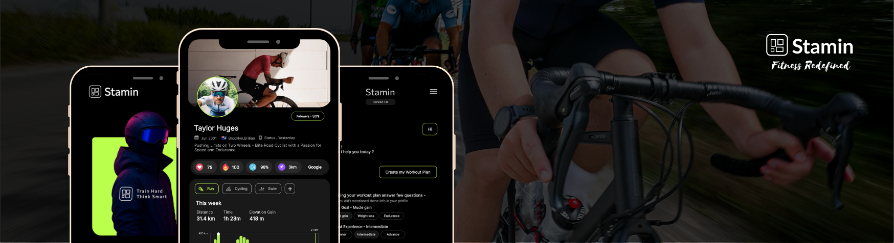
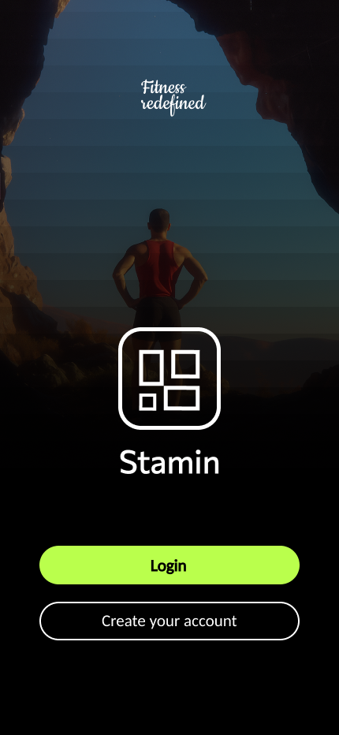
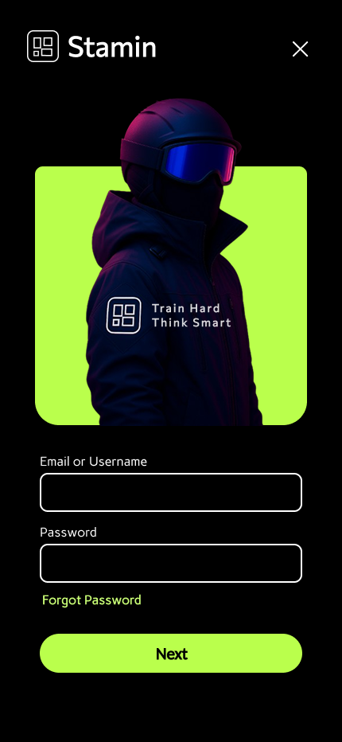
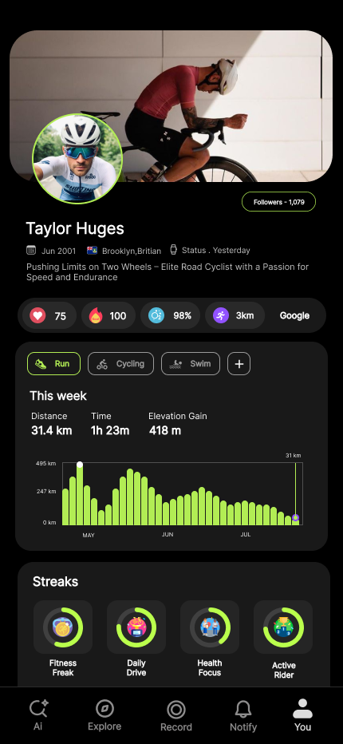
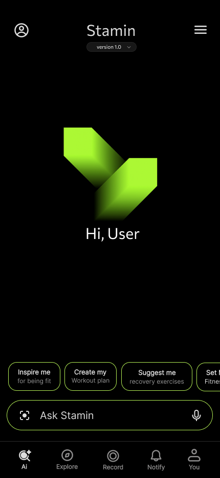
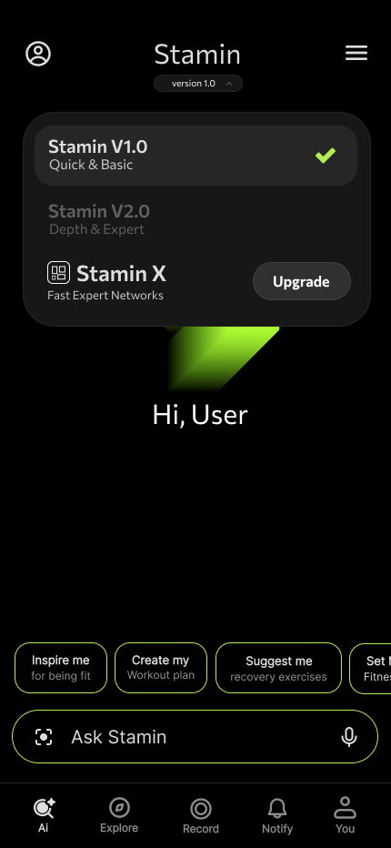
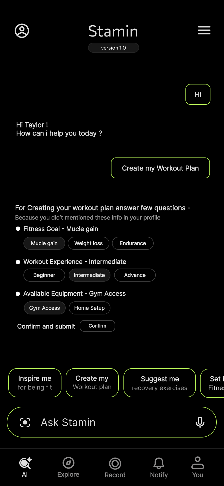

<p align="center">
  
</p>

# Stamin

## AI-Powered Personal Fitness & Health Coach (Hybrid Mobile Application)

Stamin is an AI-based personal fitness and health coaching platform that delivers deeply personalized health, fitness, and diet guidance by understanding each user’s physical metrics, activity data, medical context, and lifestyle patterns.

Unlike generic fitness applications, Stamin builds a context-aware user profile and provides recommendations tailored only to that individual, continuously adapting as new data is added.

---

## 📸 Screenshots / Demo

<p align="center">
  
  
  
</p>

**Authentication & Profile Flow**  
Stamin uses secure email + OTP–based authentication with a temporary user state during onboarding until signup is fully completed. Once authenticated, users can create a rich fitness profile including profilePic and cover pictures, basic physical metrics, recorded fitness activities, connected smartwatch data, and optional medical reports. This data forms the core context used by the AI to deliver personalized health and fitness guidance.

<br />
<br />

<p align="center">
  
  
  
</p>

**AI Fitness Guide Experience**  
The AI assistant builds a personalized fitness profile by analyzing the user’s onboarding data, activity history (running, cycling, etc.), fitness goals, and interaction patterns. Based on this understanding, it provides tailored workout suggestions, health insights, progress feedback, and motivational guidance, helping users make data-driven improvements to their fitness and overall well-being.

---

## ✨ Features

### 🔐 Authentication & Account Management
- Email + OTP–based user registration  
- Temporary user concept until signup process is fully completed  
- Secure user login  
- Forgot password & account recovery flow  

### 👤 User Profile
- Personalized health & fitness profile  
- Profile picture and cover image  
- Height, weight, age, and general details  
- Optional medical report uploads  
- Smartwatch data integration  

### ⚙️ Profile & Privacy Settings
- Update profile picture and cover image  
- Edit general profile information  
- Full control over sensitive data visibility:
  - Height  
  - Weight  
  - Age  
  - Medical reports  
- Privacy-first design — user owns their data  

### 🏃 Activity Recording
- Method-oriented sports activity tracking  
- Record activities such as:
  - Running  
  - Cycling  
  - Other physical workouts  
- Designed for future expansion into detailed activity analytics  

### 🤖 AI Personal Health & Fitness Guide
- Dedicated AI assistant experience  
- Users interact with their personal AI health coach  
- Personalized guidance for:
  - Fitness improvement  
  - Diet planning  
  - Health-related questions  
- AI responses are generated using user profile, activity data, and medical context  
- Dynamically asks short follow-up questions when required data is missing  

---

## 🧠 How Stamin Works (High Level)

1. User creates an account and completes onboarding  
2. Health & fitness profile is configured  
3. Optional smartwatch and medical data are added  
4. Stamin AI builds a contextual user model  
5. User interacts with the AI coach  
6. AI provides personalized, data-driven recommendations  

---

## 🏗️ Architecture Overview

Stamin uses a dual-backend architecture with clear separation of concerns.

```text
React Native Mobile App
        |
        | REST APIs
        v
Stamin_Backend_Node (Node.js / Express)
        |
        | REST APIs
        v
Stamin_Backend_ML (Flask / Python / AI)
This approach allows independent scaling of application logic and AI workloads.

🛠️ Tech Stack
📱 Frontend
React Native (Bare Workflow)

TypeScript

Redux Toolkit (centralized state management)

Zod (schema validation)

🌐 Backend – Application Layer
Repository: Stamin_Backend_Node

Node.js

Express.js

REST API architecture

MVC design pattern

Monolithic architecture (initial phase)

Handles:

Authentication & authorization

User profiles & privacy settings

Activity recording

Smartwatch data

Core business logic

🧠 Backend – AI / ML Layer
Repository: Stamin_Backend_ML

Python

Flask API

Handles:

AI reasoning & inference

Personalized health & fitness recommendations

Future ML model training and experimentation

Note: File structure and API boundaries are defined. Core AI functionality will be implemented incrementally.

🗄️ Databases
MongoDB (current)

Planned dual-database strategy:

SQL database → structured user & account data

MongoDB → high-frequency and flexible data exchange

☁️ Infrastructure & DevOps (Planned / In Progress)
Docker (backend containerization)

Redis (caching & fast access)

BullMQ (background jobs & async processing)

AWS EC2 (deployment)

AWS S3 (media storage)

⚙️ Setup & Installation (Local)
# Clone repositories
git clone <frontend-repo>
git clone <Stamin_Backend_Node>
git clone <Stamin_Backend_ML>

# Backend (Node.js)
cd Stamin_Backend_Node
npm install
npm run dev

# Backend (ML)
cd ../Stamin_Backend_ML
pip install -r requirements.txt
python app.py

# Frontend
cd ../frontend
npm install
npx react-native run-android
# or
npx react-native run-ios
Environment variables and detailed setup instructions will be documented as the project matures.

🚀 Usage
Register and complete user onboarding

Configure profile and privacy settings

Record physical activities

Open the AI coach page

Ask fitness, diet, or health-related questions

Receive personalized recommendations

🧩 Key Design Decisions
Dual-backend architecture to isolate AI from core app logic

REST APIs for language-agnostic communication

Monolith-first approach for faster early development

MVC pattern for maintainability

Privacy-by-design approach

AI kept as an independent service for future scalability

📈 Scalability & Performance Considerations
Redis planned for caching frequently accessed data

BullMQ for background tasks and AI workloads

Independent scaling of AI backend

Docker-based deployments for consistency

AWS infrastructure selected for horizontal scalability

🛣️ Roadmap / Future Improvements
AI model optimization and fine-tuning

Advanced health & activity analytics

Expanded smartwatch ecosystem support

Microservice extraction if required

Offline-first capabilities

Role-based access for medical professionals

📄 License
MIT License (to be finalized)

👤 Author
Ravi Sharma
Software Engineer | Full-Stack & Mobile Developer